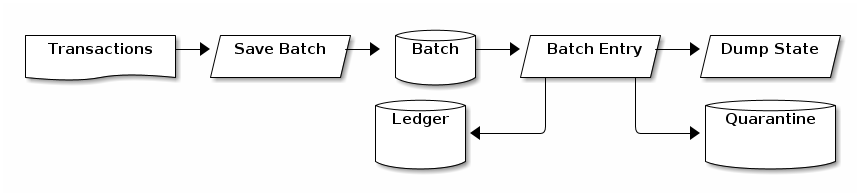

# Kleene algebra of tests and transactions

This article explores structuring of database
operations as kleene algebra expressions.  It
demonstrates how to build application out of
small units of code called tests and joint them
together using operators.

[https://github.com/BlockfreieOrg/kat_tutorial](https://github.com/BlockfreieOrg/kat_tutorial)


The code for this tutorial can be found here.
If you find yourself implementing this in your
favorite language send me a link.

# Kleene algebra

A Kleene algebra is an algebraic structure comprised
of operators and symbols.

```math
(K,+ , * ,  ⃰,0,1)
```

Symbols
   * K - K is a collection of operations that either succeed or fail.

	   Within this collection there are a few _distingushed_ elements
       * 0 - a trivial operation that fails
       * 1 - a trivial operation that is successful

Operators
   * a * b - sequential composition
   * a + b : choice
   * a ⃰  :  iteration


If you use regular expressions these operators should
be familiar.

# Motivation - ledger

Lets consider the problem of maintaining a ledger.  We have a database
backed ledger and we are processing batches of transactions.

Transition entries specified by the following data structure

```go
type Entry struct {
     FromId         int `json:"FromId"`
     ToId           int `json:"ToId"`
     TransferAmount int `json:"TransferAmount"`
}
```

Transactions are provided in a file one transaction per line
in JSON format.  Below is a sample transaction entry.

```javascript
{"FromId":1,"ToId":2,"TransferAmount":10}
```

These entries are loaded from the file and processed by the
application.  Assuming you have a copy of the project and
the golang environment.

```shell
go build
```

You can then run a sample transactions.  The operational argument
verbose allows you to see the SQL statements that are executed.

```shell
./kat_tutorial -dbfile=/tmp/tmp.db -infile=sample.json -verbose
```
It should apply the transactions to the ledger
and output the final state of ledger.



The application first loads the transactions into a batch
table.  The method batch entry then applies the transaction
either updating the ledger or quarantining the transaction.
The appication then dumps the state of the ledger.


# 0,K - operations that either succeed or fail

We can express a test as a function that takes a transaction and
returns a boolean.  It is important to note that the tests themseleves
are statelesss.  The statefullness comes from the database and the
databas eonly, the use of global variables, closures is not permitted.
For this implementation this is given by the following type
expression:

```go
type KatExpression func(*sql.Tx) bool
```

Let consider the symbol 0 (zero).  The implementation of zero
simply returns false which indicating the command has failed.

```go
func Zero(*sql.Tx) bool { return false }
```

A possible test if the check if a transaction has a postive amount.

```go
func PositiveTransfer(entry Entry)  KatExpression {
        return func(tx *sql.Tx) bool {
                return entry.TransferAmount > 0
        }
}
```

# 1,! - negation

So lets make a new expression out of old expression by introducing
the not operator.

```haskell
func Not(op KatExpression) (KatExpression) {
        return func(tx *sql.Tx) bool {
                return ! op(tx)
        }
}
```

Intuitively we know that negating 0 (zero) should give us 1 (one).

```math
1 = ¬ 0
```

The not operator which negates an expression and
can be used to create one from zero.

```go
var One KatExpression = Not(Zero)
```

# * - sequential composition

Typically when a transaction is recieved it is verified.
First the transfer amount must be postive and the sender
and the reciever must exists

```math
VerifyTransaction = PositiveTransfer * SenderExists * RecieverExists
```

This introduces the need for the * operator we shall refer to as And.

```go
func And(args ... KatExpression) (KatExpression) {
	return func(tx *sql.Tx) bool {
		for _, op := range args {
			if (!op(tx)){
				return false
			}
		}
		return true
	}
}
```

This behaves as we would expect an and operator to work.  It first
tries the first operator,  If this returns true it then tries the
next term.  If any of the operators return false it returns false
otherwise it returns true.

We can implement the psuedo code from the begining of the section.

```go
func VerifyTransaction(entry Entry) go_kat.KatExpression {
        return go_kat.And(PositiveTransfer(entry),
		          SenderExists(entry),
		          RecieverExists(entry))
}
```

# + - Choice

Lets consider the follow algebraic expressions

```math
ensureSender = !senderExists + createSender

ensureReciever = !recieveExists + createReciever
```

If the sender/reciever does not exists then create the sender/reciever.

In order to implement the Or operatior is introduced.

```go
func Or(args ... KatExpression) (KatExpression) {
	return func(tx *sql.Tx) bool {
		result := true
		var salt = xid.New()
		tx.Exec(fmt.Sprintf("savepoint %s", salt))
		for _, op := range args {
			result = op(tx)
			if result {
				break
			} else {
				tx.Exec(fmt.Sprintf("rollback to savepoint %s", salt))
			}
		}
		return result
	}
}
```

This operator tries an operation if it fails it rolls back
the transaction and tries the next one.  It fails if all
the operators return false the identity of the or operator.


The expression ensureSender is implemented

```go
func EnsureSender(entry Entry) KatExpression {
	return Or(SenderExists(entry),
		         CreateSender(entry))
}
```

#      ⃰- Star

Proccessing a transaction is described by the following equation.

```math
processEntry = removeBatch
               * ((ensureSender
                  * ensureReciever
                  * verifyTransaction
                  * saveTransaction
                  * senderPositiveBalance
                  * receiverPositiveBalance)
                 + quarantineTransaction)
```

The details of the functions in the expression are ommited for brevity
but it first checks the transaction applies the transaction then
checks the result.  Where if a transaction can not be processed
because a step returned false it is placed in quarantine.  We then
want to process each transaction for each entry.

```math
batchEntry = processEntry ⃰
```

We then need a star operator.  This operator applies an expression
until it returns false.

```go
func Star(op KatExpression) (KatExpression) {
	return func(tx *sql.Tx) bool {
		for {
			var salt = xid.New()
			tx.Exec(fmt.Sprintf("savepoint %s", salt))
			if (!op(tx)){
				tx.Exec(fmt.Sprintf("rollback %s", salt))
				return true
			}
		}

	}
}
```
There is little helper function that is needed to load
a batch entry and then process the transaction.

```go
func ProcessBatch(op (func(int,Entry) KatExpression)) KatExpression {
	return func(tx *sql.Tx) bool {
		var id , fromId , toId, transferAmount = -1, -1, -1, -1
		var sql = `SELECT Id, FromId, ToId, TransferAmount
                           FROM batch`
		var result = ExecuteQuery(sql,id)(&id,&fromId,&toId,&transferAmount)(tx)
		if result {
			result = op(id,Entry{fromId , toId, transferAmount})(tx)
		}
		return result
	}
}
```

The expression procces entry is implemented as follows

```go
func ProcessEntry(id int,entry Entry) KatExpression {
	return And(And(BatchExists(id),DeleteBatch(id),Not(BatchExists(id))),
	           Or(And(EnsureSender(entry),
	                  EnsureReciever(entry),
	                  VerifyTransaction(entry),
	                  SaveTransaction(entry),
	                  SenderPositiveBalance(entry),
			  ReceiverPositiveBalance(entry)),
	              QuarantineTransaction(entry)))
}
```

The entries are processed by the simple expression

```go
var BatchEntry = Star(ProcessBatch(ProcessEntry))
```

# Fun with Algebra

Using this approach one ends up with small blocks of code held
together with operators.  Note the code is absent the error checking
code and conditional code which tend to increase complexity.
Formulating an operation as a Kleene algebraic expression
allows it to be restructured algebraically. That's to say also long as
two expressions are algebraically equivalent they are (and do) the
same things.  Here are a few identities to get started.

```math
0 + p = p
p + p = p
1 * p = p
p(q + r) = p*q + p*r
0 * p = p
1 + p p ⃰ = p ⃰
```

Consider the following simplifications:

```math
Zero = Zero * ensureSender

ensureSender = One * ensureSender
```

Well we know these follows from the the rule of alegbra.

```math
ensureSender * ensureReciever =
((!senderExists + createSender) * !recieveExists)
+
((!senderExists + createSender) * createReciever)
```

So with very little examination we know that these two expressions are
equivalent.  So this gives a way to quick restructure code without much
effort.

# Hoare triples

A common pattern for for operations of these form is a Haore triple.

```math
   {P} * C *  {Q}
```

   * P - is a precondition
   * C - command
   * Q - is a post condition

A command C is guarded by a precondition P.  The post condition
Q is checked after the command is run to ensure the command has
the desired side effects.

An example of this is remove batch.

```math
removeBatch = batchExists * deleteBatch * !batchExists
```

This first checks if the batch entry exists, then removes it
and then checks if it is removed.  These pre and post condition
ensure that remove batch behaves as expected.


Another example is a better createSender
that has the requiste pre and post conditional tests for creating
a sender.

```math
betterCreateSender = !senderExists * createSender * senderExists
```
# Further Reading and Sources

## [Kleene Algebra with Tests: A Tutorial](www.cl.cam.ac.uk/events/ramics13/KozenTutorial1.pdf)

This approach is based on Kleene Algebra with tests.  The difference
being is it difficult in an imperative language to make tests with
guarantees of no side effects.  As a result the tests and the commands
were combined in this approach.

## [A Short Introduction to Hoare Logic](https://www.cse.iitb.ac.in/~supratik/courses/cs615/msri_ss08.pdf)

Structuring the tests is an important to the approach and this gives
an great overview to structure them.
